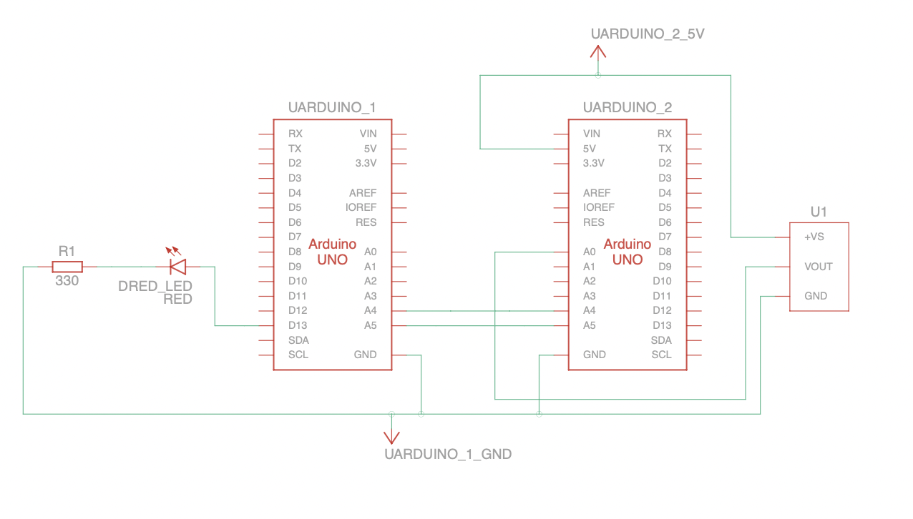

# Automatizacion Workshop 7
Santiago Botero -  Nicolas Imbachi
 - [Diagrama](#diagrama)
 - [Sensor](#sensor)
 - [Maestro Esclavo](#maestro-esclavo)
   - [Hardware](#hardware)
   - [Software](#software)
 - [Conectividad](#conectividad)
   - [Conectividad física](#conectividad-física)
   - [Protocolo de comunicación](#protocolo-de-comunicación)
   - [Codigo](#codigo)
 - [Testing y video](#testing-y-video)
## Diagrama

## Sensor

Sensor digital de temperatura TMP36.

- Temperatura: -50°C - +125°C.
- Estable con grandes capacidades de carga.
- ±2°C de exactitud.
- Funcinal con voltajes desde 2.7 V hasta 5.5 V.

En nuestro caso se hara recepcion de los datos por medio del pin A0 de la placa Arduino Uno Rev3. 

Referencia: [TMP36 Datasheet](https://pdf1.alldatasheet.com/datasheet-pdf/view/49108/AD/TMP36.html) 

## Maestro Esclavo

Se hace uso de una resistencia de 330 Ω, un LED rojo y 2 Arduino Uno Rev3, estas placas tienen las siguientes especificaciones:

### Hardware

- Microcontrolador	ATmega328P
- Voltaje operativo	5V
- Voltaje de entrada (Recomendado)	7-12V
- Voltaje de entrada (Limite)	6-20V
- Pines digitales I/O	14
- Pines digitales PWM  I/0 6
- Pines entrada analogica	6
- Memoria flash	32 KB (ATmega328P) of which 0.5 KB used by bootloader
- SRAM	2 KB (ATmega328P)
- EEPROM	1 KB (ATmega328P)
- Clock speed	16 MHz
- LED_BUILTIN	13
- Largo	68.6 mm
- Ancho	53.4 mm
- Peso	25 g

Referencia: [Arduino Uno Rev3](https://docs.arduino.cc/resources/datasheets/A000066-datasheet.pdf)

### Software

- Autodesk Tinkercad.
- Arduino IDE

Referencia: [Autodesk Tinkercad](https://www.tinkercad.com/), [Arduino IDE](https://docs.arduino.cc)

## Conectividad

### Conectividad física
El protocolo de capa 1 o conectividad fisica I2C.

I2C funciona mediante una arquitectura de bus, donde se conectan mediante dos hilos los circuitos integrados, este protocolo se utiliza debido a el aprovechamiento de los pines y su facil implementación.

Referencia: [Protocolo I2C Arduino](https://docs.arduino.cc/learn/communication/wire) 

### Protocolo de comunicación
La comunicacion se realiza por medio del protocolo I2C, el cual envia datos haciendo uso de los pines  SDA y SCL. Cada pulso en el pin SCL le indica al dispositivo receptor que lea el valor del pin SDA. De esta forma los bits son puestos en SDA uno por uno.

En las placas Arduino Uno Rev  los pines usados son A4 para SDA y A5 para SCL.

Referencia: [I2C Protocol ](https://docs.arduino.cc/learn/communication/wire)

### Codigo
#### Maestro
```cpp
#include <Wire.h>

bool Sig = false;
String Msg; 
int Actual = 0;
float Temperature = 0.0;

void setup()
{
  pinMode(LED_BUILTIN, OUTPUT);
  Serial.begin(9600);
  Wire.begin(4);
  Wire.onRequest(Request);
  Wire.onReceive(Ans);
}

void loop()
{
  Actual = analogRead(0);
  Temperature = map(analogRead(0),0,1023,-50,450);
  Serial.println(Temperature);
  delay(500);
}

void Request()
{
  if (Sig == true)
  {
    Wire.write(String(Temperature, 3).length());
    Sig = false;
  }
  else {
    Serial.println(String(Temperature,3));
    Wire.println(String(Temperature,3));
  }
}

void Ans(int Num)
{
  if(Wire.read() == 'B'){
    Sig = true;
  }
} 
```
#### Esclavo
```cpp
#include <Wire.h>

void setup()
{
  pinMode(13, OUTPUT);
  Wire.begin();
  Serial.begin(9600);
}

void loop()
{
  Wire.beginTransmission(4);
  Wire.write('B');
  Wire.endTransmission(); 
  
  Wire.requestFrom(4,1);
  byte l = Wire.read();
  Wire.requestFrom(4, (int(l)));
  String T = "";
  while (Wire.available()){
  	char M = Wire.read();
    T = T + M;
  }
  Serial.println(T);
  if (T.toFloat()>30) {
  	digitalWrite(13, 1);
  }
  else {
  	digitalWrite(13, 0);
  }
  delay(500);              
}
```
## Testing y video
[](https://youtu.be/vt5fpE0bzSY)

